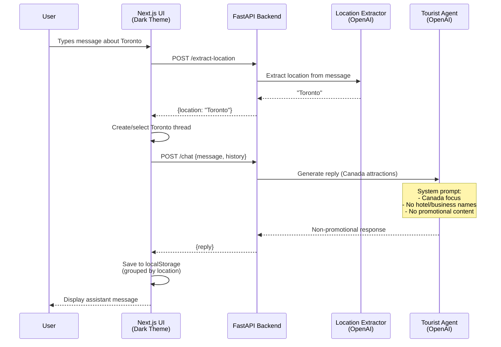

# Canada Tourist Attractions Chatbot

An AI-powered chatbot that helps users discover tourist attractions across Canada. Built with FastAPI (backend) and Next.js (frontend), featuring location-based chat history and a strict non-promotional policy.

## 🏗️ Project Structure

```
Chatbot_for_Practice/
├── backend/                    # FastAPI application
│   ├── app/
│   │   ├── main.py            # FastAPI app & CORS setup
│   │   ├── agent.py           # OpenAI-powered Canada tourist agent
│   │   ├── location.py        # Location extraction service
│   │   ├── settings.py        # Environment configuration loader
│   │   └── schemas.py         # Pydantic request/response models
│   ├── config.py              # Application configuration defaults
│   ├── tests/
│   │   └── test_api.py        # Pytest suite (mocked OpenAI)
│   ├── Dockerfile             # Backend container image
│   ├── env.example            # Example .env file
│   └── pyproject.toml         # Python dependencies (uv)
├── frontend/                   # Next.js React application
│   ├── app/
│   │   ├── page.tsx           # Main chatbot UI (dark theme)
│   │   ├── layout.tsx         # App layout
│   │   └── globals.css        # Tailwind + dark theme styles
│   ├── package.json           # Node.js dependencies
│   └── tsconfig.json          # TypeScript configuration
├── .env                        # Environment variables (OPENAI_API_KEY)
└── run_wsl.sh                 # WSL script to run both servers + tests
```

## 🎯 Agent Workflow



## ✨ Features

### Backend (FastAPI)
- **Canada Tourist Agent**: OpenAI-powered assistant specialized in Canadian tourist attractions
- **Non-Promotional Policy**: 
  - Does NOT mention specific hotel/business names
  - Does NOT promote or advertise any business
  - Suggests generic criteria (neighborhoods, amenities, price ranges) instead
- **Location-Based Organization**: Extracts location from user queries (Toronto, Alberta, Vancouver, etc.)
- **Fallback Mode**: Works without OpenAI API key (deterministic responses for development)
- **CORS Enabled**: Direct browser-to-backend communication
- **Endpoints**:
  - `POST /chat` - Generate agent responses
  - `POST /extract-location` - Extract location from message
  - `GET /healthz` - Health check

### Frontend (Next.js)
- **Dark/Black Theme**: Modern, sleek UI
- **Location-Based Chat History**: Left sidebar groups conversations by location
- **Thread Management**: Automatically creates new threads for new locations
- **LocalStorage Persistence**: Chat history survives page reloads
- **Real-time Updates**: Loading indicators and responsive UI

### Testing
- **5 Comprehensive Tests**:
  - Health check endpoint
  - Non-promotional constraint validation
  - Location extraction accuracy
  - Input validation (empty message → 422)
  - OpenAI wiring verification (mocked)

## 🚀 Getting Started

### Prerequisites

- **Python 3.12+**
- **Node.js 18+**
- **uv** (Python package manager)
- **Docker** (optional, for containerized backend)
- **WSL** (if on Windows)

### Environment Setup

1. **Create `.env` file** in the project root directory:

```bash
# .env (in project root)
OPENAI_API_KEY=sk-your-openai-api-key-here
```

2. **Configuration Settings** are stored in `backend/config.py`:
   - `OPENAI_MODEL` - Default: `gpt-4o-mini`
   - `OPENAI_LOCATION_MODEL` - Default: `gpt-4o-mini`
   - `CORS_ALLOW_ORIGINS` - Default: `["http://localhost:3000"]`

> **Note**: Backend works without `OPENAI_API_KEY` (uses fallback mode), but location extraction and agent responses will be deterministic.

## 🧪 Running Tests

### Backend Tests (Pytest)

#### Option 1: WSL test script (recommended on Windows)

```bash
chmod +x run_tests_wsl.sh
./run_tests_wsl.sh
```

> This uses the existing `backend/.venv-wsl` created by `./run_wsl.sh`.

#### Option 2: Manual (uv)

```bash
cd backend
uv sync                 # Install dependencies
uv run pytest           # Run all tests
uv run pytest -v        # Verbose output
```

**Expected Output:**
```
============================= test session starts =============================
collected 5 items

tests/test_api.py::test_healthz_ok PASSED                                [ 20%]
tests/test_api.py::test_chat_fallback_toronto_reasonable_and_non_promotional PASSED [ 40%]
tests/test_api.py::test_extract_location_fallback PASSED                 [ 60%]
tests/test_api.py::test_validation_empty_message_422 PASSED              [ 80%]
tests/test_api.py::test_openai_wiring_is_used_when_api_key_present PASSED [100%]

============================== 5 passed in 3.61s
```

## 🖥️ Running Servers

### Option 1: Run Both Servers (Recommended)

**WSL Script** (runs tests, then starts both servers):

```bash
chmod +x run_wsl.sh
./run_wsl.sh
```

This will:
1. Install backend dependencies (`uv sync`)
2. Run backend tests (`pytest`)
3. Start backend on `http://localhost:8000`
4. Install frontend dependencies (`npm install`)
5. Start frontend on `http://localhost:3000`

Press `Ctrl+C` to stop both servers.

### Option 2: Run Servers Individually

**Backend Only:**

```bash
cd backend
uv sync
uv run uvicorn app.main:app --reload --port 8000
```

Backend will be available at: `http://localhost:8000`

**Frontend Only:**

```bash
cd frontend
npm install
npm run dev -- --port 3000
```

Frontend will be available at: `http://localhost:3000`

### Option 3: Docker (Backend Only)

**Build Image:**

```bash
docker build -t canada-agent-backend ./backend
```

**Run Container:**

```bash
# With .env file
docker run -p 8000:8000 --env-file backend/.env canada-agent-backend

# Or with environment variables
docker run -p 8000:8000 \
  -e OPENAI_API_KEY=sk-your-key \
  -e OPENAI_MODEL=gpt-4 \
  canada-agent-backend
```

Backend will be available at: `http://localhost:8000`

## 📡 API Documentation

Once the backend is running, visit:
- **Swagger UI**: http://localhost:8000/docs
- **ReDoc**: http://localhost:8000/redoc

### Example API Calls

**Chat Endpoint:**

```bash
curl -X POST http://localhost:8000/chat \
  -H "Content-Type: application/json" \
  -d '{
    "message": "What are the top attractions in Toronto?",
    "history": []
  }'
```

**Extract Location:**

```bash
curl -X POST http://localhost:8000/extract-location \
  -H "Content-Type: application/json" \
  -d '{"message": "Best things to do in Vancouver"}'
```

**Response:**
```json
{
  "location": "Vancouver"
}
```

## 🎨 Frontend Usage

1. Open `http://localhost:3000` in your browser
2. Type a question about Canadian tourist attractions (e.g., "Top attractions in Montreal?")
3. The chatbot will:
   - Extract the location (Montreal)
   - Create/select a thread for Montreal in the left sidebar
   - Generate a response with tourist recommendations
4. Switch between location threads by clicking items in the left sidebar
5. Chat history is automatically saved to your browser's localStorage

## 🔧 Development

### Backend Hot Reload

The `--reload` flag in uvicorn enables automatic server restart on code changes:

```bash
cd backend
uv run uvicorn app.main:app --reload --port 8000
```

### Frontend Hot Reload

Next.js automatically reloads on file changes:

```bash
cd frontend
npm run dev
```

## 🛡️ Non-Promotional Policy

The agent is configured with a strict system prompt to:
- ✅ Suggest **generic criteria** (neighborhoods, transit, amenities, price ranges)
- ✅ Recommend **categories** (boutique hotel, hostel, family-friendly chain)
- ❌ **Never mention** specific hotel/business names
- ❌ **Never promote** or advertise any business

This is enforced via:
1. System prompt in `backend/app/agent.py`
2. Test validation in `backend/tests/test_api.py`

## 📦 Dependencies

### Backend
- **FastAPI** - Web framework
- **OpenAI** - LLM API client
- **Uvicorn** - ASGI server
- **Pydantic** - Data validation
- **Pytest** - Testing framework

### Frontend
- **Next.js 15** - React framework
- **React 19** - UI library
- **Tailwind CSS** - Styling
- **TypeScript** - Type safety

## 🤝 Contributing

1. Make changes to `backend/` or `frontend/`
2. Run tests: `cd backend && uv run pytest`
3. Test locally: `./run_wsl.sh`
4. Ensure no linter errors

## 📝 License

This project is for educational/interview purposes.

---

**Built with ❤️ using FastAPI, Next.js, and OpenAI**
